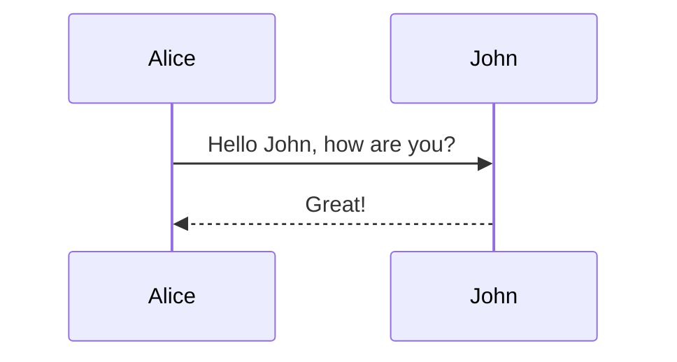

# Slidev 调研报告：可借鉴功能清单

> 调研日期：2026-06-02  
> 调研目的：为 LumiSlate【自定义模式】寻找可直接借鉴的功能与架构设计  
> 原始参考：Marp Slide Plugin → 发现 Slidev 更符合预期

---

## 目录

- [一、Slidev 核心架构概览](#一slidev-核心架构概览)
- [二、可直接借鉴的功能](#二可直接借鉴的功能)
  - [1. Frontmatter 驱动的配置系统](#1-frontmatter-驱动的配置系统)
  - [2. 布局模板系统（Layouts）](#2-布局模板系统layouts)
  - [3. MDC 语法扩展](#3-mdc-语法扩展)
  - [4. Slide-Scoped CSS（单页样式隔离）](#4-slide-scoped-css单页样式隔离)
  - [5. UnoCSS Shortcuts / 设计 Tokens](#5-unocss-shortcuts--设计-tokens)
  - [6. 代码块增强（Shiki 高亮 + 行高亮）](#6-代码块增强shiki-高亮--行高亮)
  - [7. Mermaid / KaTeX 原生支持](#7-mermaid--katex-原生支持)
  - [8. slidev-parser 的架构启发](#8-slidev-parser-的架构启发)
- [三、暂不借鉴的功能](#三暂不借鉴的功能)
- [四、推荐实施优先级](#四推荐实施优先级)
- [五、参考资源](#五参考资源)

---

## 一、Slidev 核心架构概览

| 层级 | 技术/机制 | 说明 |
|------|----------|------|
| 源文件 | Markdown (`slides.md`) | 使用 `---` 分隔幻灯片，YAML frontmatter 控制配置 |
| 解析器 | `@slidev/parser` | 将 Markdown 解析为 slide 对象数组（含 frontmatter + content） |
| 编译器 | Vite + Vue 3 SFC | 每页 slide 编译为 Vue 单文件组件 |
| 样式引擎 | UnoCSS | 按需原子化 CSS，Tailwind 兼容语法 |
| 渲染器 | Vue 3 Runtime | 客户端路由切换幻灯片，支持动画与交互 |
| 主题系统 | npm 包 | 主题 = 布局组件 + 默认样式 + UnoCSS 预设 |

关键洞察：**Slidev 不是「AI 生成 HTML」，而是「Markdown → 结构化数据 → 模板渲染」**。这与 LumiSlate 当前架构不同，但 frontmatter 配置层、布局系统、MDC 语法等理念完全通用。

---

## 二、可直接借鉴的功能

### 1. Frontmatter 驱动的配置系统

Slidev 的核心设计哲学：**一切配置走 frontmatter**。

#### Slidev 的 frontmatter 字段

```markdown
---
theme: seriph              # 主题包名
title: Welcome to Slidev   # 页面标题
info: |                    # 演讲者信息
  ## Presentation Description
  Multi-line info text
highlighter: shiki         # 代码高亮器
transition: slide-left     # 默认转场动画
mdc: true                  # 启用 MDC 语法
---
```

#### 每页幻灯片独立 frontmatter

```markdown
---
layout: center             # 布局模板
background: /bg.png        # 背景图
class: text-white          # 注入的 CSS 类
clicks: 3                  # 点击动画步数
disabled: false            # 是否禁用
hide: false                # 是否隐藏
---

# Slide 2
```

#### 借鉴到 LumiSlate

当前 LumiSlate 的 Marp 模式只解析了 `size` 字段（16:9 / 4:3 / 1:1），可以大幅扩展：

| 新增字段 | 类型 | 用途 |
|---------|------|------|
| `layout` | string | 控制当前幻灯片布局：`default` / `cover` / `center` / `two-cols` / `image` |
| `class` | string | 给当前 `<section>` 注入自定义 CSS 类（如 `text-center bg-gradient`） |
| `background` | string | 单页背景色（`#f0f0f0`）或背景图路径 |
| `theme` | string | 引用预设主题（对应 LumiSlate 的 skill 或 CSS 预设） |
| `transition` | string | 幻灯片切换动画（如未来支持横向翻页） |

**实现位置**：`extractFrontmatter()` 解析逻辑 → 组装进 prompt → AI 生成对应结构。

**收益**：用户不用在 prompt 里描述"这页要居中"，一行 frontmatter 即可控制，AI 输出更稳定。

---

### 2. 布局模板系统（Layouts）

Slidev 内置多种布局，通过 frontmatter `layout` 字段切换：

| 布局名 | 说明 |
|--------|------|
| `default` | 标准全屏幻灯片 |
| `center` | 内容居中 |
| `cover` | 封面/标题页 |
| `two-cols` | 双栏布局 |
| `image` | 全屏图片背景 |
| `iframe` | 嵌入外部网页 |

#### 双栏布局示例

```markdown
---
layout: two-cols
class: my-custom-class
---

# Left Column

- Point 1
- Point 2

::right::

# Right Column

```ts
console.log('Hello')
```
```

#### 借鉴到 LumiSlate

**方式一：预处理阶段转换**
- `preprocess.ts` 解析 `::right::` 分隔符
- 转换为 `<div class="grid grid-cols-2">` 结构
- 左侧内容放入 `col-left`，右侧放入 `col-right`

**方式二：Prompt 层提示**
- `skills.ts` 的 `MARP_BODY` 中增加 layout 说明
- AI 根据 `layout` 值生成对应 DOM 骨架

这比让用户用自然语言描述"左边文字右边代码"更精确、更可控。

---

### 3. MDC 语法扩展

Slidev 的 **MDC（Markdown Component）** 语法极大增强了 Markdown 的表达能力：

| 语法 | 效果 | 转换目标 |
|------|------|---------|
| `# 标题 {.text-blue-500}` | 标题加 class | `<h1 class="text-blue-500">` |
| `{width=500}` | 图片加属性 | `` |
| `[red text]{style="color:red"}` | 行内样式 | `<span style="color:red">red text</span>` |
| `::block-component{prop="value"}` | 块级组件 | `<div class="block-component" data-prop="value">` |

#### 启用方式

```markdown
---
mdc: true
---

This is a [red text]{style="color:red"} :inline-component{prop="value"}

{width=500px lazy}

::block-component{prop="value"}
The **default** slot
::
```

#### 借鉴到 LumiSlate

在 `preprocess.ts` 中增加 MDC 预处理步骤：

1. `{.class-name}` → 提取并注入到前一个元素
2. `{attr=value}` → 转换为 HTML 属性
3. `::slot-name::` → 转换为带 class 的 `<div>`

**收益**：用户可以直接在 Markdown 里写 Tailwind 类，无需 AI "猜"样式，渲染结果更可控。

---

### 4. Slide-Scoped CSS（单页样式隔离）

Slidev 允许在任意幻灯片内嵌入 `<style>` 块：

```markdown
# 我的幻灯片

<style scoped>
h1 { color: #3b82f6; }
p { font-size: 1.2em; }
</style>
```

#### 实现机制

- 开发时：Vue 的 `<style scoped>` 机制自动添加 `data-v-xxx` 属性选择器
- 运行时：只作用于当前 slide 组件

#### 借鉴到 LumiSlate

Marp 模式下每个 `<section>` 就是一个 slide：

**方案 A：Shadow DOM**
- 每个 `<section>` 使用 Shadow DOM
- 内部 `<style>` 天然隔离

**方案 B：Scope 属性**
- 预处理阶段提取 `<style scoped>`
- 给选择器加上 scope 属性（如 `[data-slide="3"] h1`）
- 将处理后的 CSS 注入到该 `<section>` 内

**方案 C：简单隔离（推荐）**
- 把 `<style>` 直接放在该 `<section>` 内部
- 利用 CSS 的层叠规则，配合特定的 class 前缀实现伪隔离

**收益**：用户可以为单页写特殊样式，不污染全局，尤其适合"封面要特殊设计"的场景。

---

### 5. UnoCSS Shortcuts / 设计 Tokens

Slidev 通过 `uno.config.ts` 让用户定义 shortcuts（快捷类名）和 theme tokens：

```typescript
import { defineConfig } from 'unocss'

export default defineConfig({
  shortcuts: {
    'slide-title': 'text-4xl font-bold text-primary',
    'slide-body': 'text-lg text-gray-700 leading-relaxed',
    'bg-main': 'bg-white text-[#181818] dark:(bg-[#121212] text-[#ddd])',
  },
  theme: {
    colors: {
      primary: '#3b82f6',
      secondary: '#64748b',
    }
  }
})
```

#### 借鉴到 LumiSlate

**当前状态**：LumiSlate 已经在 AI prompt 中要求使用 Tailwind CDN。

**可扩展**：
1. 在 `LumiSlateSettings` 中新增 `designTokens` / `unoShortcuts` 配置字段
2. 用户通过设置面板定义自己的 shortcuts：
   ```json
   {
     "unoShortcuts": {
       "brand-title": "text-3xl font-serif text-blue-600",
       "brand-body": "text-base text-gray-700 leading-relaxed",
       "card": "bg-white rounded-xl shadow-lg p-6"
     }
   }
   ```
3. `skills.ts` 组装 prompt 时，将这些 shortcuts 注入到 `SHARED_DESIGN_DIRECTIVES`
4. AI 生成 HTML 时优先使用用户定义的 shortcuts

**收益**：
- 风格统一：同一份配置，所有 AI 生成结果使用同一套设计 token
- 可复用：用户定义一次 `card` 样式，多篇文章复用
- 可维护：改配置即可批量更新风格，无需逐篇修改 prompt

---

### 6. 代码块增强（Shiki 高亮 + 行高亮）

Slidev 使用 **Shiki**（VS Code 同款引擎）做语法高亮，支持：

#### 基础高亮

````markdown
```ts
const msg: string = 'hello'
```
````

#### 行高亮（点击动画）

````markdown
```ts {1,3|5|all}
console.log('Line 1')
console.log('Line 2')
console.log('Line 3')
console.log('Line 4')
console.log('Line 5')
```
````

- `{1,3}`：第 1、3 行高亮
- `|`：分隔点击步骤
- `{all}`：全部高亮

#### TwoSlash（TypeScript 类型提示）

````markdown
```ts twoslash
const msg: string = 'hello'
//     ^?
```
````

#### 借鉴到 LumiSlate

**方案 A：AI 生成阶段**
- 在 `MARP_BODY` / skill prompt 中要求："使用 Shiki 的 class-based 渲染"
- AI 生成带 `shiki` class 和对应 token class 的 HTML
- 通过 CDN 引入 Shiki CSS 主题文件

**方案 B：预处理阶段标记**
- `preprocess.ts` 解析 `{1,3|5|all}` 语法
- 转化为 data 属性：`data-highlight-lines="1,3"`
- 在注入的 CSS 中定义高亮样式

**收益**：
- Shiki 的渲染质量和 VS Code 完全一致
- 行高亮让技术演示类内容表达力更强
- 支持 100+ 语言，无需维护多套高亮规则

---

### 7. Mermaid / KaTeX 原生支持

Slidev 原生集成：

| 类型 | 语法 | 渲染 |
|------|------|------|
| Mermaid 图表 | ` ```mermaid ` | 流程图、时序图、类图等 |
| KaTeX 公式 | `$$...$$` 或 `$...$` | 数学公式、化学式 |

#### Mermaid 示例

````markdown

````

#### KaTeX 示例

```markdown
Inline: $E=mc^2$

Block:
$$
\frac{\partial f}{\partial x} = 2x
$$
```

#### 借鉴到 LumiSlate

**预处理阶段检测**：
1. `preprocess.ts` 扫描 Markdown 中的 ` ```mermaid ` 代码块
2. 在 `MARP_BODY` 中增加提示："如果原文包含 Mermaid 语法，生成对应的 `<div class="mermaid">` 并引入 Mermaid CDN"
3. 同理处理 KaTeX 公式

**或更直接的方案**：
- 预处理时不做转换，但在 `assemblePrompt` 阶段明确告知 AI："原文包含以下 Mermaid 图表和 LaTeX 公式，请在生成的 HTML 中正确渲染"
- AI 生成时直接输出 Mermaid/KaTeX 兼容的 HTML

**收益**：技术笔记中大量存在的流程图、公式可以正确渲染，大幅提升实用性。

---

### 8. slidev-parser 的架构启发

[slidev-parser](https://github.com/MarleneJiang/slidev-parser) 是一个**浏览器端**的 Slidev 渲染器，无需 Node.js 构建：

```vue
<script setup>
import { SlideRender } from 'slidev-parser'
import 'slidev-parser/index.css'

const slide = {
  frontmatter: { layout: 'cover' },
  content: '# My Presentation {.text-blue-500}\n\nContent in **Markdown**',
  note: 'Speaker notes here'
}
</script>

<template>
  <SlideRender
    id="my-slide"
    :slide="slide"
    :zoom="1"
    :slide-aspect="16 / 9"
  />
</template>
```

#### 与官方架构对比

| | slidev-parser (MarleneJiang) | @slidev/parser (官方) |
|---|---|---|
| 运行环境 | 浏览器端 | Node.js / 构建时 |
| SSR 支持 | ❌ 不兼容 | ✅ |
| 用途 | 动态渲染、在线编辑器 | CLI 构建、开发服务器 |
| 依赖 | 自包含 | 需 Vite 生态 |

#### 对 LumiSlate 的启发

**思路：增加「本地渲染」fallback 路径**

当前 LumiSlate 所有 HTML 都走 AI 生成。可以考虑：

1. **简单模式**：Markdown 不经 AI，直接用 marked.js + 主题 CSS 渲染
   - 优点：零成本、零延迟、离线可用
   - 适用：纯文字笔记、不需要 AI 美化的场景

2. **AI 增强模式**：当前已有的 AI 生成路径
   - 适用：需要精美排版、复杂布局、设计感的场景

3. **智能路由**：根据内容复杂度自动选择路径
   - 简单内容 → 本地渲染
   - 复杂内容 / 用户明确要求 → AI 生成

**更现实的短期方案**：
- 在 AI 服务不可用或用户未配置 API 时，提供本地渲染降级
- 保证插件基础功能始终可用

---

## 三、暂不借鉴的功能

| Slidev 功能 | 暂不借鉴理由 |
|------------|-------------|
| `v-click` 点击逐步显示 | Marp 模式是垂直滚动长页，非幻灯片播放，逐步显示意义不大 |
| Drauu 绘图标注 | 与 LumiSlate 的反向编辑（click-to-edit）存在交互冲突 |
| Monaco Editor 嵌入 | 过重，且 LumiSlate 的编辑发生在 Obsidian 主编辑器 |
| 演讲者模式 / 双屏同步 | 不适用 Obsidian 插件场景 |
| RecordRTC 录屏 | 超出当前产品范围 |
| Vue 组件嵌入 | LumiSlate 是 iframe 沙箱渲染，不支持 Vue runtime |
| 远程控制 / 手机遥控 | 不适用 |

---

## 四、推荐实施优先级

| 优先级 | 功能 | 预估工作量 | 影响 | 实现文件 |
|--------|------|-----------|------|---------|
| **P0** | 扩展 frontmatter（layout / class / background） | 小 | 用户控制粒度大幅提升 | `main.ts` frontmatter 解析 |
| **P0** | Mermaid + KaTeX 预处理 | 中 | 技术笔记渲染质变 | `preprocess.ts` + `skills.ts` |
| **P1** | UnoCSS shortcuts / 用户 design tokens | 中 | AI 输出风格统一、可复用 | `settings.ts` + `skills.ts` |
| **P1** | MDC 语法预处理（`{.class}` / `::right::`） | 中 | Markdown 表达能力增强 | `preprocess.ts` |
| **P2** | Slide-scoped CSS | 中 | 单页样式隔离 | `preprocess.ts` + 渲染逻辑 |
| **P2** | Shiki 代码高亮替换 Prism | 小 | 视觉效果提升 | `skills.ts` prompt |
| **P3** | 本地渲染 fallback（slidev-parser 思路） | 大 | AI 不可用时降级，提升可用性 | 新增渲染路径 |

---

## 五、参考资源

| 资源 | 链接 | 说明 |
|------|------|------|
| Slidev 官方文档 | https://sli.dev/ | 完整功能文档 |
| Slidev 语法指南 | https://sli.dev/guide/syntax | Markdown 语法扩展 |
| Slidev 主题系统 | https://sli.dev/themes/use | 主题安装与使用 |
| UnoCSS 配置 | https://sli.dev/custom/config-unocss | UnoCSS 自定义配置 |
| Slidev 功能列表 | https://sli.dev/features/ | 全部功能特性 |
| slidev-parser（浏览器端） | https://github.com/MarleneJiang/slidev-parser | 浏览器端独立渲染实现 |
| Slidev GitHub | https://github.com/slidevjs/slidev | 源码与 issue |

---

## 附录：Slidev vs LumiSlate 架构对比

```
Slidev:
Markdown (.md)
  → @slidev/parser (Node.js) → slide 对象数组
  → Vite + Vue SFC 编译器 → Vue 组件
  → UnoCSS 引擎 → 原子化 CSS
  → Vue 3 Runtime → 浏览器渲染

LumiSlate (当前):
Markdown (.md)
  → extractFrontmatter → 分离配置与正文
  → assemblePrompt → 组装 AI 提示词
  → AI Service (HTTP/CLI) → 流式生成 HTML
  → extractHtml → 清洗 AI 输出
  → injectReverseMappingScript → 注入双向编辑
  → iframe.srcdoc → 沙箱渲染
```

**核心差异**：Slidev 是「结构化渲染」（Markdown → 数据结构 → 模板），LumiSlate 是「生成式渲染」（Markdown → Prompt → AI 生成 HTML）。但两者在 **frontmatter 配置层、预处理层、样式层** 有大量可复用的设计理念。
